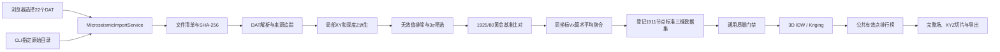

# GeoModelingPlatform v0.5 微震第二案例闭环设计

> 状态：交互设计已获用户逐节确认，待书面规格最终复核。
> 目标版本：v0.5.0。
> 基线：已发布的 `v0.4.1`，合并提交
> `78aa80bb4a245910fe7b41bffba8c540bb47e5ae`。

## 1. 目标

v0.5 将现有微震审计基础升级为平台内可复现的第二个完整案例：

```text
22 个原始 DAT
→ 原始文件与记录契约校验
→ 局部 XYZ 派生
→ 全局一次性 3σ 筛选
→ 黄金基准严格比对
→ 同坐标 Vx 算术平均聚合
→ 标准三维数据集
→ 质量门禁
→ 3D IDW / 普通 Kriging 调参
→ 空间验证与排行榜
→ 完整场、X/Y/Z 切片
→ 正式选择与证据导出
```

浏览器和 CLI 都必须支持原始 DAT 入口，并共用同一个领域服务。v0.5
不复制 v0.4 已实现的通用建模能力，只在其前方增加微震数据适配层。

完成后，答辩者应能证明：

1. 平台不仅接受已经整理好的 CSV，也能处理具有行业格式和历史问题的原始数据；
2. 从原始 token 到最终插值成果的每一步均可追溯；
3. 3σ 规则、局部坐标和单位均由显式版本化契约控制；
4. 模型优劣由无数据泄漏的空间验证决定，而不是凭视觉选择；
5. 微震与电阻率可以作为独立案例展示，但不会被错误叠加到同一绝对空间。

## 2. 方案选择

### 2.1 未采用：CLI 派生后再手工上传 CSV

该方案开发量较小，但浏览器仍无法从原始数据完成闭环，答辩时需要在两个工具之间切换，也容易出现 CLI 与浏览器规则漂移。

### 2.2 采用：领域适配器接入现有通用流水线

新增微震导入服务，负责多文件校验、解析、坐标派生、3σ 筛选和黄金基准比对。通过后，把 1,925 条候选记录登记成普通三维数据集，后续完全复用 v0.4 的质量门禁、任务系统、IDW、Kriging、公共有效点指标、成果工作台和导出。

浏览器与 CLI 只是不同入口，二者调用同一个服务。

### 2.3 未采用：独立微震建模系统

单独实现微震页面、任务和成果结构会复制大量现有代码，难以保证指标与状态语义一致。

### 2.4 暂不采用：通用数据源插件框架

现在把微震、电阻率和瓦斯全部抽象为插件会扩大 v0.5 的范围。当前只建立足够清晰的适配边界和派生登记结构，后续有第二个原始格式适配器时再决定是否抽象为插件框架。

## 3. 范围

### 3.1 v0.5 必做

- 浏览器选择文件夹或选择 22 个 DAT；
- CLI 从原始 DAT 目录执行派生；
- 浏览器与 CLI 共用同一个微震导入服务；
- 22 文件清单、NUL、源记录、特殊 NaN 和原始哈希校验；
- 已确认局部 XY、深度和显示 Z 派生；
- 全局一次性、样本标准差口径的 3σ 筛选；
- 2,006 / 2,005 / 80 / 1,925 分层结果与完整来源追踪；
- 两份现有黄金基准逐条和字节哈希回归；
- 13 组同坐标冲突显式聚合为 1,911 个唯一建模节点；
- 自动登记标准三维数据集和字段映射；
- 3D IDW、普通 Kriging 和垂向距离缩放调参；
- 整根 XY 采样柱空间验证和公共有效点排行榜；
- 完整三维场、X/Y/Z 正交切片、诊断层、正式选择与导出；
- 真实本地数据回归、便携 CI、浏览器 Mock/Live E2E；
- v0.4.1 通用平台与 v0.3.1 电阻率演示完整回归。

### 3.2 明确不做

- 绝对地理坐标、EPSG 或与其他案例的空间叠加；
- DSI、机器学习预测、时间序列预测；
- 任意斜切；
- 最终答辩 UI 全面重构；
- 瓦斯案例恢复；
- iServer 通用成果自动发布；
- 把距离缩放包装成已被地质证据验证的各向异性结论；
- 修改、删除或回填原始 DAT。

## 4. 总体架构



### 4.1 模块边界

- `microseismic` 领域层负责原始格式、测点几何、派生规则、筛选规则和领域报告；
- `platform` 层负责案例、数据集版本、任务、实验、候选结果和导出；
- `modeling` 层只接收规范化的 `x/y/z/value`，不识别 W1、L1 或 DAT；
- API 和 CLI 不实现统计规则，只做输入适配、权限边界、响应和退出码；
- 前端不计算坐标、Z-score 或黄金基准，只展示服务端证据。

### 4.2 原子性

导入先在暂存目录中完成全部解析、派生和黄金门禁。只有所有检查通过后，才原子移动到正式数据集目录并写入数据库。

发生异常时：

- 数据库行、正式文件、暂存文件分别独立补偿；
- 清理异常写完整日志，但不得覆盖最初的业务异常；
- 失败导入不得成为可建模数据集；
- 允许保留脱敏诊断响应，不允许返回本机绝对路径。

## 5. 输入与来源契约

### 5.1 DAT 文件集合

- 正式输入必须恰好包含配置登记的 22 个 DAT；
- 按安全 basename 识别文件，不信任客户端相对路径；
- 缺失、重复或未知 DAT 均阻断；
- W28 没有正式 DAT，只保留为冲突登记，永不进入样本和模型；
- 每个文件设置单文件和总上传大小上限；
- 空文件、错误表头、非预期编码或无法解析的内容必须给出文件级诊断。

### 5.2 原始记录

- 稳定样本主键为 `测点 ID + DAT 源行号`，例如 `W1:2`；
- 原始 `WL/2` token、`Vx` token、文件名、源行号和文件 SHA-256 必须保存；
- 22 个 NUL 终止伪行只登记诊断，不计入源记录；
- 源记录总数必须为 2,006，分线为 L1/L2/L3 = 823/819/364；
- W8 的 `1.#QNAN0` 原样保存，标记为非数值，不改为 0、不填补、不进入 3σ；
- 有限数值记录必须为 2,005，分线为 822/819/364。

### 5.3 来源优先级

领域规则来源按以下顺序处理：

1. 22 个原始 DAT；
2. 已确认的测线图、点间距表和用户明确确认；
3. 已生成的 1,925/80 黄金基准；
4. 论文只作低置信背景，不覆盖以上来源。

原始 DAT 和相邻资料保持只读，不得由平台回写。

## 6. 局部三维坐标契约

### 6.1 平面局部坐标

- W16 是 L2/L3 交点和局部原点 `(0, 0)`；
- X 正向沿 L3 指向 W24；
- Y 正向沿 L2 指向 W20；
- L1 与 L3 平行；
- L1/L2 交点为 W5，坐标 `(0, 220)`；
- W16 到 W17 为 110 m，W17 到 W5 为 110 m；
- 全部 W1—W27 正式点坐标取自版本化配置和已确认坐标表；
- W28 不得出现在正式坐标集合中。

本版本不从论文图片重新量算坐标。

### 6.2 深度与显示 Z

```text
depth_m = WL_half_km × 1000
z_local_m = -depth_m
```

- `depth_m` 向下为正，用于分析和筛选；
- `z_local_m` 向上为正，用于三维显示和插值坐标；
- `Vx` 单位为 `km/s`；
- 原字段、派生字段、单位、符号和规则版本必须同时保存；
- 坐标类型固定为 `local_engineering_m`，不得声明 EPSG。

### 6.3 版本语义

为了复现现有黄金 CSV，派生表中的 `RULE_VERSION` 保留
`microseismic_local_3d_v0.2b_confirmed_2026-07-20`。平台适配器实现版本
`v0.5.0` 作为独立元数据保存，不能静默改写黄金表字段。

## 7. 3σ 筛选契约

### 7.1 精确算法

1. 先从 2,006 条源记录中排除唯一非有限值，得到 2,005 条输入；
2. 不按测线、测点或深度区间分组；
3. 对 `depth_m` 和 `vx_km_s` 分别计算全局均值；
4. 标准差使用样本标准差，即 `N-1`、`ddof=1`；
5. 在完整的 2,005 条输入上只计算一次，不迭代剔除和重算；
6. 任一 `abs(zscore) > 3` 的记录进入剔除表；
7. 不对剔除记录插值、回填或删除源记录。

现有黄金数据反算锚点为：

| 字段 | 均值 | 样本标准差 |
|---|---:|---:|
| `depth_m` | 676.620332169576 | 1138.5704399315825 |
| `vx_km_s` | 0.9019579860349127 | 0.7493428022868682 |

这些数值用于回归验证，算法本身仍必须从输入计算，不得直接把均值和标准差硬编码为处理结果。

### 7.2 分层结果

| 层 | 数量 | 说明 |
|---|---:|---|
| 源记录 | 2,006 | 含 W8 特殊非数值记录 |
| 有限记录 | 2,005 | 3σ 输入 |
| 3σ 剔除 | 80 | 深度 72、速度 8；当前无交叉 |
| 正式候选 | 1,925 | L1/L2/L3 = 792/783/350 |

剔除表必须包含：

- `DEPTH_ZSCORE`
- `VX_ZSCORE`
- `FILTER_STATUS`
- `FILTER_REASON`

### 7.3 黄金基准

| 文件 | 行数 | 固定 SHA-256 |
|---|---:|---|
| `微震局部三维点_3Sigma_1925.csv` | 1,925 | `4F7A0886B54BB1776E9D7CA98299F8F86E67897BA19236FB151C3FC9E2AE1513` |
| `微震3Sigma剔除记录_80.csv` | 80 | `3752B2F62DE4E56121B7AF66C205CCF3984270D332636335E559E7E2745872B1` |

通过条件：

- 保留集合主键和字段逐条一致；
- 剔除集合主键、原因和 Z-score 逐条一致；
- 采用固定列序、记录顺序、编码、换行和数值格式后，输出字节哈希一致；
- 22 个 DAT 处理前后哈希不变。

任一条件不满足时，派生状态为 `blocked`，不得创建可建模数据集。

## 8. 同坐标聚合契约

1,925 条黄金候选中有 13 组记录具有完全相同的
`X_LOCAL_M/Y_LOCAL_M/Z_LOCAL_M`，但 `VX_KM_S` 不同：

- 共涉及 27 条候选记录；
- 相对唯一坐标多出 14 条记录；
- 聚合后形成 1,911 个唯一三维建模节点；
- 13 组分布为 L1 4 组、L2 6 组、L3 3 组；
- 当前最大组内 Vx 极差为 `0.913554 km/s`。

一个标量场在同一坐标必须只有一个建模值，直接把冲突记录交给 IDW 会造成精确点语义不确定，交给 Kriging 还可能造成奇异矩阵。因此采用以下显式规则：

1. 3σ 和黄金基准仍以全部 1,925 条候选记录为准，聚合不改变黄金表；
2. 只对三个坐标值完全相等的记录分组，不使用距离容差合并邻近点；
3. 每组建模值为该组全部候选 `VX_KM_S` 的算术平均值；
4. 单记录组原值不变；
5. `aggregated_nodes_1911.csv` 中的 `VX_KM_S` 明确表示上述算术平均建模值；
6. 每个节点保存 `source_sample_ids`、`sample_count`、`vx_min_km_s`、
   `vx_max_km_s` 和 `vx_sample_std_km_s`；
7. `vx_sample_std_km_s` 在 `sample_count=1` 时为空，在大于 1 时使用
   `ddof=1`；
8. 标准三维数据集和正式插值使用 1,911 个唯一节点；
9. 质量报告同时展示 1,925 条候选、13 个冲突组、14 条聚合差额和
   1,911 个建模节点；
10. 不允许通过删除记录、选择第一条、给 Z 添加微小偏移或静默放宽通用质量门禁处理冲突。

聚合规则属于平台 v0.5 适配器契约，必须有独立规则版本、报告、测试和导出工件。

## 9. 数据落盘与登记

成功导入形成不可变数据版本目录：

```text
datasets/<case_id>/<dataset_id>/
├─ source/
│  ├─ <22 个原始 DAT 副本>
│  └─ source_manifest.json
├─ derived/
│  ├─ source_records_2006.csv
│  ├─ invalid_records_1.csv
│  ├─ rejected_3sigma_80.csv
│  ├─ accepted_modeling_1925.csv
│  ├─ aggregated_nodes_1911.csv
│  ├─ modeling_provenance.parquet
│  └─ derivation_report.json
└─ standardized.parquet
```

约束：

- 目录位于 `GEOMODELING_DATA_DIR`，不进入 Git；
- `source_manifest.json` 是多文件来源的权威入口；
- 数据库保存数据集身份、状态、规则版本、相对工件身份和哈希；
- 公共 DTO 只暴露下载端点和逻辑身份，不暴露内部路径；
- `standardized.parquet` 使用 1,911 个唯一节点和通用列
  `source_row/x/y/z/value/is_numeric_valid`；
- `modeling_provenance.parquet` 以相同 `source_row` 保存测点、测线、原样本
  ID 和聚合统计，用于分组诊断；
- 派生表保留完整领域列，不能被通用标准表替代。

## 10. 浏览器流程

首页微震案例卡从 `upload_required` 升级为原始数据适配入口。

### 10.1 四步导入向导

1. **选择原始数据**
   - Chromium 提供“选择文件夹”；
   - 同时提供“选择 22 个 DAT”兼容入口。
2. **原始数据核验**
   - 展示文件、哈希、记录数、NUL、W8 特殊值和文件集合问题；
   - 阻断时提供诊断下载。
3. **派生结果确认**
   - 展示 2,006 / 2,005 / 80 / 1,925；
   - 展示 13 个同坐标冲突组和 1,911 个唯一建模节点；
   - 展示三条测线计数、坐标规则、Z 符号和黄金比对。
4. **进入建模**
   - 自动映射 X=`X_LOCAL_M`、Y=`Y_LOCAL_M`、Z=`Z_LOCAL_M`、
     value=`VX_KM_S`；
   - 显示只读映射确认后进入现有质量门禁和调参实验室。

### 10.2 页面原则

- 前端不计算统计结果；
- 后端阻断不能被“继续”按钮绕过；
- 页面刷新后可以从案例和数据集状态恢复；
- 离开页面不取消已经提交的建模任务；
- 沿用 v0.4.1 的返回首页和失败态导航；
- 本版本不重排整个页面或更换视觉系统。

## 11. API 与 CLI

### 11.1 API

建议新增：

```text
POST /api/cases/{case_id}/microseismic-imports
GET  /api/datasets/{dataset_id}/derivation
```

`POST` 接收 22 个 multipart DAT，同步完成轻量派生。成功后原子创建标准数据集；失败时返回现有统一错误封套和可公开诊断。

`GET` 返回：

- 来源清单摘要；
- 规则和适配器版本；
- 源记录、有限记录、3σ剔除、黄金候选和唯一建模节点的分层计数；
- 同坐标聚合统计和 1,911 节点口径；
- 坐标与单位声明；
- 黄金基准结果；
- 派生和质量门禁状态；
- 可下载工件身份。

现有实验、运行、成果、切片、正式选择和导出 API 保持兼容。

### 11.2 CLI

新增：

```powershell
geomodeling microseismic derive `
  --source-dir <DAT目录> `
  --output-dir <输出目录>
```

只生成派生表、清单、校验和诊断，不写平台数据库。

新增：

```powershell
geomodeling microseismic import-case `
  --source-dir <DAT目录> `
  --data-dir <平台数据目录>
```

使用同一导入服务创建案例和标准数据集。命令输出案例 ID、数据集 ID、计数、规则版本和门禁结果；失败返回非零退出码。

现有 `inventory/parse/validate/export-reports/run-audit` 保留兼容，并更新过时的“XY/Z 和清洗未确认”报告文案。

## 12. 建模与空间验证

### 12.1 验证分组

微震禁止随机按行拆分。正式使用现有三维整柱折分：

- 相同 XY 的全部深度样本属于同一空间组；
- 1,911 个建模节点按 XY 归入 22 个正式测点空间组；
- 默认 5 折，固定随机种子；
- 同一根采样柱不得同时出现在训练和验证集；
- 每个验证样本恰好出现一次；
- 自动变异函数只使用当前折的训练数据。

该口径模拟“整个测点未参加训练时的空间预测”，避免相邻深度样本泄漏导致指标虚高。

### 12.2 排行榜

- 所有成功候选在公共有效点交集上重新计算指标；
- RMSE 升序为主要排序；
- MAE、R²、Bias、覆盖率和运行时间为辅助指标；
- 增加按测线、测点的诊断指标；
- 分组诊断不替代公共总体指标，也不因样本数较多而单独决定冠军；
- 无有效预测或公共有效集合为空的候选不得排名。

## 13. 插值参数

### 13.1 IDW 预设

- `power`: 1、2、3；
- `neighbor_count`: 8、16、24、32；
- `min_neighbors`: 默认 3；
- `search_radius`: 默认不限，仍允许手工设置；
- `z_scale`: 0.5、1、2。

### 13.2 普通 Kriging 预设

- `variogram_model`: spherical、exponential、gaussian；
- `neighbor_count`: 12、24、36；
- `variogram_mode`: auto 或 manual；
- manual 模式继续要求完整 `nugget/sill/range`；
- `z_scale`: 0.5、1、2。

网格搜索组合数继续受 50 组硬上限约束，页面实时显示组合数并阻止超限提交。

### 13.3 `z_scale` 语义

拟合和邻域查询使用：

```text
(x_scaled, y_scaled, z_scaled) = (x, y, z × z_scale)
```

- 原始坐标和输出网格仍保存物理坐标，不写回缩放坐标；
- IDW 距离、Kriging 邻域和变异函数拟合使用同一缩放规则；
- 每个验证折只在训练数据上拟合；
- 0.5 表示弱化垂向距离，2 表示加强垂向距离；
- 参数名称在界面解释为“距离缩放实验参数”；
- 由空间验证比较，不声称其值代表已确认的地质各向异性。

## 14. 正式网格与成果

黄金候选数据实际范围：

| 维度 | 最小值 | 最大值 |
|---|---:|---:|
| X (m) | -750 | 960 |
| Y (m) | -995 | 1310 |
| Z (m) | -4086.538 | -37.5 |
| Vx (km/s) | 0.15 | 3.134339 |

默认 XYZ 分辨率为 50 m，预计约 13.8 万网格单元。页面必须在提交前显示预计单元数；继续使用最多 100 万单元硬上限。

成果工作台复用现有实现并增加微震语义：

- 完整三维 Vx 场；
- X/Y/Z 正交切片；
- 色带、阈值和 Z 夸张；
- 1,911 个唯一建模节点、网格和叠加模式；
- 1,925 条黄金候选可作为来源诊断层查看，重复坐标不得误报为独立空间位置；
- 80 个 3σ 剔除点作为默认关闭的诊断层；
- W8 非数值记录只在数据诊断中展示，不作为数值点绘制；
- 正式模型选择必须填写理由。

## 15. 导出契约

在现有模型证据 ZIP 基础上增加：

- `source_manifest.json`
- `derivation_report.json`
- `source_records_2006.csv`
- `invalid_records_1.csv`
- `rejected_3sigma_80.csv`
- `accepted_modeling_1925.csv`
- `aggregated_nodes_1911.csv`
- 同坐标聚合规则和来源样本映射
- 坐标、单位、符号和规则版本说明
- 黄金基准校验结果
- 按测线/测点误差诊断

原有参数、折分、逐点预测、公共指标、正式选择、完整网格和切片工件继续保留。ZIP manifest 固定文件身份、字节数和 SHA-256。

## 16. 错误处理

以下情况必须阻断：

- 文件集合不完整、重复或未知；
- 文件大小、表头、编码或内容不符合契约；
- 记录数、测线计数、NUL 或特殊值不符；
- 测点坐标缺失、重复或规则版本不符；
- 3σ 结果与黄金基准不一致；
- 同坐标聚合未得到 13 组冲突、14 条聚合差额和 1,911 个唯一节点；
- 聚合后的标准数据仍存在同坐标不同属性；
- 规范化表未通过通用三维质量门禁；
- 文件和数据库只完成部分提交。

错误响应：

- 使用统一代码、消息和有限诊断字段；
- 指明实际值与期望值；
- 不返回本机绝对路径、原始文件正文或堆栈；
- 服务端日志保留内部上下文和清理异常；
- 最初业务错误始终优先于补偿清理错误。

## 17. 测试与验收

### 17.1 便携测试

- 生成型 DAT fixture 覆盖文件集合、NUL、特殊 NaN 和错误输入；
- 小型确定性数据验证 `ddof=1`、单次全局 3σ 和边界 `abs(z)=3`；
- 坐标、深度、Z 符号和 W28 排除；
- 完全相同坐标的算术平均、单记录原值、来源 ID、极差和样本标准差；
- 禁止容差合并邻近坐标、删第一条或 Z 抖动；
- 浏览器与 CLI 共用服务的契约测试；
- 上传限额、路径安全、DTO 脱敏和补偿事务；
- `z_scale` 在 IDW/Kriging 中的一致性和无泄漏；
- 整根 XY 柱折分与公共有效点；
- API、前端组件、Mock E2E 和隔离 Live E2E。

CI 不包含私有原始 DAT。Live E2E 使用测试时生成的 22 文件合成包，并验证完整浏览器路径。

### 17.2 本机真实数据回归

标记为 `local_data`，只读访问相邻资料目录：

- 22 个 DAT、66,880 字节；
- 2,006 / 2,005 / 80 / 1,925；
- 13 个冲突组、27 条组内记录、14 条聚合差额和 1,911 个建模节点；
- 分线计数和 W8/W28 语义；
- 两份黄金 CSV 逐条与哈希一致；
- 22 个原始 DAT 哈希不变；
- 浏览器和 CLI 生成的标准数据哈希一致。

### 17.3 建模实测

- 至少完成一组 3D IDW 和一组普通 Kriging；
- 公共有效点非零，所有公开候选使用同一公共集合；
- 验证折无 XY 柱重叠；
- 完整场不超过网格硬上限；
- X/Y/Z 切片坐标来自真实网格；
- 80 个剔除点开关不影响模型和指标。

### 17.4 回归

- v0.4.1 通用上传、质量门禁、调参、排行榜、切片、选择和导出；
- v0.4.1 `demo-check`、安全启动和 Mock/Live E2E；
- v0.3.1 电阻率只读案例、S3M 降级渲染和六级证据链；
- 现有 v0.2a 微震审计命令兼容。

## 18. v0.5.0 发布门

发布前必须满足：

1. 后端、前端、Mock E2E、Live E2E 和 CI 全部通过；
2. 本机真实 DAT 黄金回归通过；
3. 浏览器与 CLI 派生结果一致；
4. 1,925 条候选到 1,911 个唯一节点的聚合口径通过真实数据回归；
5. IDW 和普通 Kriging 至少各一组真实运行；
6. 使用全新 `GEOMODELING_DATA_DIR` 完成一次从 DAT 到 ZIP 的完整彩排；
7. 首页、电阻率案例和 v0.4.1 通用案例无回归；
8. README、架构、数据契约、当前状态、产品蓝图和运行手册同步；
9. PR 评审、合并和 main CI 通过；
10. 标签与 Release 只在用户明确批准后创建。

## 19. 已知边界与答辩表述

- XY 是根据已确认关系建立的局部工程坐标，不是绝对测量坐标；
- `WL/2` 按当前项目确认直接换算深度，必须展示规则来源；
- 3σ 是当前项目固定筛选规则，不等于证明所有被剔除样本在物理上错误；
- 1,925 条候选来自固定黄金门禁，不进行数据补全；
- 正式插值使用 1,911 个唯一节点；同坐标候选取算术平均并保留全部来源，
  不能把聚合描述成删除 14 条原始数据；
- 插值给出测点之间的估计场，不等于真实地下结构的唯一解；
- `z_scale` 是由空间验证比较的距离参数，不是已确认地质各向异性；
- 通用浏览器成果不自动等于 iServer 已发布成果；
- 微震、电阻率和瓦斯没有共同绝对坐标时只能作为独立案例。
