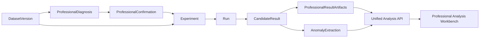

# GeoModelingPlatform v0.6 专业建模增强设计

> 日期：2026-07-26
> 目标版本：v0.6.0
> 基线：已发布 v0.5.0，merge commit
> `d37eb94787a9f2a95242bf0ce0479d78ac7d0667`

## 1. 目标

v0.6 在现有通用建模平台上增加一条统一、可审计的专业空间分析
流水线：

```text
标准数据集
→ 半变异函数与方向诊断
→ 人工确认各向异性和搜索邻域
→ IDW / 普通 Kriging 候选实验
→ 空间折分检查与公共有效指标
→ Kriging 原生方差 + 全算法经验误差尺度
→ 完整场与异常连通区
→ 参数—指标—空间结果联动与证据导出
```

一个候选模型身份必须贯穿参数、折分、预测、指标、不确定性、
成果和异常区。平台不得从不同运行中临时拼接看似完整的分析结果。

## 2. 已确认决策

1. v0.6 完成路线图中全部专业建模增强，不拆成只实现一部分能力的
   v0.6.x。
2. 采用统一专业分析流水线，不新建独立 Kriging 专家系统。
3. 半变异函数、各向异性和 Kriging 原生方差只属于普通 Kriging。
4. 搜索邻域、空间折分可视化、经验误差分析、异常区及联动比较适用于
   所有支持算法。
5. 不确定性分两层表达：
   - Kriging 原生估计标准差；
   - 全算法基于折外残差的经验误差尺度。
6. 异常区采用显式高值/低值阈值、可选不确定性上限和连通区域提取。
7. 各向异性由方向诊断提供候选，必须由用户人工确认；平台不自动宣称
   地质主方向。
8. 2D 使用旋转椭圆邻域，3D 使用旋转椭球邻域，支持扇区约束。
9. 半变异函数工作台提供经验曲线、方向对比、点对数量、
   自动/手动拟合和拟合证据。
10. 空间折分检查器可逐折查看训练/验证点、泄漏检查、指标和残差。
11. 统一分析台支持一个候选查看和两个兼容候选并排比较。
12. 点对计算采用确定性有界采样：小数据全量，大数据分层抽样并披露
    采样率。
13. 验收采用微震真实主案例、合成 2D/3D 已知结构夹具和电阻率回归。
14. v0.6 只增加必要的专业分析界面，不进行 v0.9 范围的全站 UI 重做。

## 3. 范围

### 3.1 必做

- 全向及方向经验半变异函数；
- 球状、指数、高斯理论模型拟合；
- 自动拟合与人工确认 nugget、sill、range；
- 2D/3D 方向约定、各向异性变换和诊断证据；
- 旋转椭圆/椭球搜索邻域；
- 最少/最多邻点、搜索半径、扇区及每扇区上限；
- IDW 和 Kriging 共用邻域选择器；
- 普通 Kriging 原生估计方差/标准差；
- 所有算法的折外残差与经验误差尺度；
- 空间折分训练/验证可视化和泄漏证据；
- 显式阈值异常连通区；
- 参数、指标、折分、残差、不确定性和空间场联动；
- 两个兼容候选并排比较；
- 专业分析工件持久化、哈希、导出和失败证据；
- SQLite 增量迁移、API、浏览器、CLI、便携测试和真实回归；
- v0.5.0、v0.4.1 和 v0.3.1 行为回归。

### 3.2 明确不做

- 普适 Kriging、协同 Kriging、指示 Kriging；
- 稳健半变异函数估计器或超过三种的理论模型库；
- 自动采用各向异性候选；
- Bootstrap、贝叶斯后验或概率置信区间；
- 时间预测、微震事件预报或灾害预警；
- 新位置上传预测的独立业务流程；
- 任意斜切面；
- DSI-like/GOCAD 后端；
- 瓦斯正式案例；
- 跨案例空间融合；
- iServer 通用自动发布；
- 首页、导航和全站视觉体系重做。

“预测”在 v0.6 中仅表示现有空间插值对规则网格或验证点的估计，
不得描述为时间预测或风险预警。

### 3.3 能力矩阵

| 能力 | IDW | 普通 Kriging |
|---|---|---|
| 全向/方向半变异函数 | 不适用 | 支持 |
| 模型各向异性 | 不适用 | 支持，人工确认 |
| `z_scale` 权重距离 | 支持 | 旧候选兼容；新候选归一化到空间变换 |
| 旋转椭圆/椭球搜索邻域 | 支持 | 支持 |
| 扇区邻点限制 | 支持 | 支持 |
| 空间折分检查 | 支持 | 支持 |
| 折外残差与经验误差尺度 | 支持 | 支持 |
| Kriging 原生标准差 | 不适用 | 支持 |
| 显式阈值异常连通区 | 支持 | 支持 |
| 双候选兼容比较 | 支持 | 支持 |

不适用必须是类型化 capability 状态，不能以空数组、0 或失败状态表达。

## 4. 总体架构

### 4.1 模块边界



- `modeling.variogram`：经验半变异函数、理论模型和拟合；
- `modeling.anisotropy`：方向定义、旋转矩阵和尺度变换；
- `modeling.neighborhood`：椭圆/椭球邻域及扇区选择；
- `modeling.kriging`：普通 Kriging 权重、预测和原生方差；
- `modeling.uncertainty`：折外残差与经验误差尺度；
- `modeling.anomalies`：阈值掩膜、连通区和几何统计；
- `modeling.professional`：诊断编排、能力声明和工件合同；
- `platform`：身份、状态、原子落盘、迁移、导出和任务恢复；
- `api`：所有权验证后的公共 DTO；
- `web`：只展示后端工件和触发显式操作，不重算专业结果。

每个模块只依赖显式数组/模型合同，不依赖 Vue、FastAPI 或 SuperMap。

### 4.2 候选身份与兼容性

候选指纹扩展为以下内容的规范化哈希：

- 标准化数据 SHA-256；
- 算法；
- 适用时的变异函数确认快照；
- 适用时的 Kriging 各向异性变换；
- 搜索邻域；
- IDW 的 `z_scale` 或 Kriging 的规范化空间变换；
- 空间折分计划指纹；
- 其他模型参数。

旧候选没有专业工件时仍可查看原有指标和成果，但公共 DTO 必须返回：

```json
{
  "professional_capabilities": {
    "available": false,
    "reason": "LEGACY_RESULT_NOT_COMPUTED"
  }
}
```

不得为旧候选在读取时自动补算，也不得显示伪造的零值或默认曲线。

### 4.3 比较兼容指纹

两个候选只有同时满足以下条件才允许显示指标差值：

- 同一 `dataset_version_id`；
- 同一验证折分指纹；
- 同一验证目标行身份；
- 指标使用同一公共有效掩膜定义；
- 值单位一致。

兼容指纹不同仍可分别打开，但页面必须标记“不可直接比较”，禁止显示
RMSE、R² 或覆盖率差值。跨实验比较由后端重新读取保存的逐点折外预测，
构造所选候选的公共有效交集；不得复用各自实验内不同的公共掩膜。

## 5. 数据库与持久化

### 5.1 SQLite v5

在 v4 基础上增加事务迁移到 v5。迁移必须覆盖真实 v4 数据库副本，
比代码更新的数据库继续拒绝启动。

新增表：

### `professional_diagnostics`

| 字段 | 含义 |
|---|---|
| `id` | 诊断身份 |
| `dataset_version_id` | 所属不可变数据版本 |
| `status` | queued/running/succeeded/failed/interrupted |
| `config_json` | lag、方向、采样等输入 |
| `fingerprint` | 数据和配置规范化哈希 |
| `manifest_json` | 工件身份、大小和 SHA-256 |
| `error_json` | 结构化失败 |
| timestamps | 创建、更新、完成时间 |

### `professional_confirmations`

| 字段 | 含义 |
|---|---|
| `id` | 不可变确认快照身份 |
| `diagnostic_id` | 所属成功诊断 |
| `config_json` | 模型类型、参数策略、方向和比例 |
| `fingerprint` | 诊断 manifest 哈希 + 确认配置哈希 |
| `note` | 用户确认说明 |
| `created_at` | 创建时间 |

一个诊断可以产生多个确认快照，用于比较不同人工判断。确认快照创建后
不可更新；修改任何参数必须创建新快照。IDW 不创建该记录。

### `professional_result_artifacts`

| 字段 | 含义 |
|---|---|
| `id` | 工件集合身份 |
| `candidate_result_id` | 唯一候选 |
| `confirmation_id` | 可空；专业 Kriging 候选必填 |
| `status` | pending/succeeded/failed |
| `capabilities_json` | 本候选实际拥有的能力 |
| `manifest_json` | 折分、残差、方差和经验误差工件 |
| `created_at` | 创建时间 |

`candidate_result_id` 唯一，防止一个候选出现两套专业真相。

### `anomaly_extractions`

| 字段 | 含义 |
|---|---|
| `id` | 异常提取身份 |
| `candidate_result_id` | 所属已物化成果 |
| `status` | pending/succeeded/failed |
| `config_json` | 阈值、方向、误差上限、最小规模 |
| `fingerprint` | 成果网格哈希 + 配置哈希 |
| `manifest_json` | 掩膜、连通区表和摘要 |
| `error_json` | 结构化失败 |
| `created_at` | 创建时间 |

同一成果和同一配置指纹幂等返回同一成功提取。

### `analysis_jobs`

| 字段 | 含义 |
|---|---|
| `id` | 分析任务身份 |
| `job_kind` | professional_diagnosis / anomaly_extraction |
| `subject_type` / `subject_id` | 所属诊断或异常提取 |
| `request_fingerprint` | 输入身份与配置指纹 |
| `status` | queued/running/succeeded/failed/canceled/interrupted |
| `retry_of_job_id` | 显式重试来源 |
| `progress_json` | 有界进度信息 |
| `error_json` | 结构化失败 |
| timestamps | 创建、开始、完成和更新时间 |

数据库使用部分唯一索引，阻止同一 `job_kind + subject_id` 同时存在两个
queued/running 任务。不同确认快照不需要重新计算诊断。

### 5.2 专业分析任务

诊断和异常提取使用 `analysis_jobs` 持久化任务，不在 FastAPI 请求中
执行长计算。现有 Worker 扩展为带 `job_kind` 的调度器，仍保持：

- 每个资源最多一个同类在途任务；
- 进程重启后在途任务转 `interrupted`；
- 重试创建新任务并记录 `retry_of`；
- 取消只影响当前任务，不修改已有成功工件；
- 状态写入数据库后才上报成功。

不允许把专业分析塞入内存后台线程后立即返回“成功”。

### 5.3 目录

```text
datasets/<case>/<dataset>/professional/
└─ diagnostics/<diagnostic_id>/
   ├─ metadata.json
   ├─ omnidirectional.csv
   ├─ directional.csv
   ├─ fitted_models.json
   ├─ anisotropy_candidates.json
   └─ manifest.json

results/<candidate_id>/professional/
├─ fold_assignments.parquet
├─ out_of_fold_predictions.parquet
├─ residuals.parquet
├─ empirical_error_scale.npz
├─ kriging_standard_deviation.npz
├─ neighborhood_summary.json
├─ metadata.json
└─ manifest.json

results/<candidate_id>/anomalies/<extraction_id>/
├─ mask.npz
├─ components.csv
├─ summary.json
└─ manifest.json
```

IDW 不生成 `kriging_standard_deviation.npz`；manifest 必须通过
capability 明确说明“不适用”，不能用空文件占位。

全部目录采用同级临时目录写齐、回读校验、计算哈希后原子替换。失败时
逐步清理，清理异常不得覆盖原业务异常。

## 6. 半变异函数

### 6.1 经验定义

经典经验半变异函数：

\[
\gamma(h)=\frac{1}{2N(h)}
\sum_{(i,j)\in N(h)}[Z(x_i)-Z(x_j)]^2
\]

每个 bin 至少返回：

- 距离下界、上界和中心；
- 半变异值；
- 点对数量；
- 实际平均距离；
- 方位角/倾角中心和容差；
- 是否参与拟合及排除原因。

低于 `min_pairs_per_bin` 的 bin 显示但不进入拟合。有效 bin 数不足时
诊断失败，不允许静默改用当前旧版固定 12-bin 拟合。

### 6.2 点对上限

- 总点对数不超过配置上限时使用全部点对；
- 超过上限时按距离层和方向层进行确定性分层抽样；
- 随机种子来自数据 SHA-256 与诊断配置，不依赖进程时间；
- 同一输入和配置必须产生相同点对身份、曲线和哈希；
- DTO 和工件披露总点对、候选点对、实际点对、采样率和种子来源；
- 不提交私有原始点对，只保存受限的点对索引或分箱汇总。

默认上限维持现有 `50,000` 点对；是否提高只能经过性能实测，不写死为
产品宣称。

### 6.3 方向定义

坐标轴遵守标准数据集的 X/Y/Z，不解释成经纬度。

- 方位角：XY 平面内从 +X 朝 +Y 旋转，范围 `[0°, 180°)`；
- 倾角：从水平面朝 +Z，范围 `[-90°, 90°]`；
- 方向无正反，向量 `d` 与 `-d` 属于同一方向；
- 2D 不接受倾角参数；
- 角度容差必须显式保存；
- 方向 bin 的点对数不足时标记 unsupported，不外推主方向。

### 6.4 理论模型

继续支持球状、指数和高斯。公共参数：

- `nugget >= 0`；
- `partial_sill > 0`；
- `sill = nugget + partial_sill`；
- `range > 0`。

自动拟合使用按 bin 点对数加权的有界最小二乘，并保存目标函数、边界、
收敛状态和残差。人工模式允许用户修改参数，但仍执行同样的有限性和
范围校验。页面必须区分：

- `automatic_candidate`：自动候选；
- `manual_confirmed`：用户确认；
- `legacy_auto_fold_fit`：v0.5 既有折内自动拟合。

Kriging 交叉验证仍要求每一折只用训练数据拟合。数据集级诊断仅用于
建议和人工确认，不能把全数据拟合结果直接注入折内验证造成泄漏。
人工确认的是模型类型、方向、比例和参数策略；若选择固定
nugget/sill/range，它们必须被标记为用户先验，而不是“交叉验证自动
拟合结果”。

每一折保存自己的训练集拟合参数。候选被物化为完整场时：

- 自动策略在全部有效建模数据上重新拟合一次，并标记
  `final_full_data_fit`；
- 人工固定参数策略继续使用已确认参数；
- 折内参数只用于验证指标，完整数据拟合参数只用于最终空间成果；
- 页面和导出分别展示两类参数，不能把最终全数据拟合参数描述成折内
  交叉验证结果。

## 7. 各向异性

### 7.1 候选与确认

平台从方向半变异函数的有效 range/结构差异生成候选：

- 候选主方向；
- 次方向和垂向支持度；
- range 比例；
- 使用的方向 bin 与点对数；
- 稳定性警告。

候选只用于建议。用户必须确认或选择“保持各向同性”。确认记录保存：

- 方位角；
- 3D 倾角；
- 绕主轴滚转角；
- 主、次、垂向尺度比；
- 证据引用；
- 确认说明和时间。

### 7.2 变换

本节变换只属于普通 Kriging。定义物理坐标向量 `x`、旋转矩阵 `R`
和尺度矩阵
`S=diag(1/a_major, 1/a_minor, 1/a_vertical)`：

\[
x' = S R^T x
\]

Kriging 的经验半变异函数、协方差和权重计算使用 `x'`。专业 Kriging
不允许再叠加第二个不透明的 `z_scale`；旧 `z_scale` 被规范化为该
尺度矩阵的一部分。为兼容 v0.5：

- 旧候选继续按原 `z_scale` 读取；
- 新专业 Kriging 候选同时记录原始 UI 输入和最终变换矩阵；
- `z_scale=1`、比例全 1、旋转为 0 时必须等价于旧各向同性距离；
- 成果网格物理 X/Y/Z 永远不变。

同一 Kriging 候选的经验半变异函数距离、Kriging 协方差距离和经验
误差距离必须使用同一个变换指纹。

IDW 不获得 Kriging 各向异性 capability。IDW 继续使用现有
`(x, y, z × z_scale)` 距离计算权重；旋转邻域只决定哪些点可以进入
候选集合和扇区，不改变 IDW 权重距离。这样既保留 v0.5 的 `z_scale`
语义，也不把方向半变异函数或协方差各向异性强加给 IDW。

## 8. 搜索邻域

### 8.1 参数

- 2D：主半径、次半径、方位角；
- 3D：增加垂向半径、倾角和滚转角；
- `min_neighbors`；
- `max_neighbors`；
- `sector_count`；
- `max_per_sector`；
- 是否允许精确同点直接返回观测值。

半径必须有限且大于 0；`min_neighbors <= max_neighbors`；
`sector_count * max_per_sector` 不得小于 `min_neighbors`。

### 8.2 选择顺序

1. 使用包围椭球的安全外接半径做有界候选查询；
2. 在邻域自身的旋转坐标中做椭圆/椭球判定；
3. 分配扇区；
4. 每扇区按距离稳定排序并截断；
5. 合并后按距离稳定排序，限制 `max_neighbors`；
6. 少于 `min_neighbors` 时返回 NoData。

Kriging 邻域方向默认与已确认的模型各向异性方向联动，但搜索半径是
独立的有限范围参数。IDW 可设置邻域方向，但这只属于采样几何，不得
在 DTO 或页面标记为“IDW 变异函数各向异性”。

稳定排序的次键为标准数据 `source_row`，确保相同距离时结果可复现。
不得自动扩大半径、减少 `min_neighbors` 或退化为全局搜索。

每个验证点和网格查询至少保存聚合诊断：

- 候选数；
- 椭球内数量；
- 各扇区数量；
- 最终使用数；
- NoData 原因。

逐网格完整邻点列表可能过大，只保存有界抽样和汇总。

## 9. Kriging 原生不确定性

普通 Kriging 线性系统在返回权重 `λ` 的同时返回拉格朗日乘子 `μ`。
基于半变异函数形式：

\[
\sigma_k^2 = \lambda^T \gamma_0 + \mu
\]

其中 `γ0` 是目标点到邻点的半变异函数向量。

约束：

- 方差单位为值单位平方；
- 页面默认显示标准差 `sqrt(variance)`，单位与值一致；
- 精确观测点在零 nugget 条件下应接近 0；
- 仅浮点容差内的微小负值允许钳制为 0，并计入诊断；
- 显著负值、非有限值或奇异解失败时返回该目标 NoData 和原因；
- 使用最小二乘降级时必须在方差工件中标记；
- IDW 的该 capability 为 `not_applicable`。

不得把 Kriging 标准差描述成观测真值误差、概率置信区间或未来事件
风险。

## 10. 折外残差与经验误差尺度

### 10.1 折外残差

对每个候选保存稳定行身份的：

```text
source_row, fold_index, observed, predicted, residual,
absolute_error, squared_error, is_nodata, x, y, z
```

残差只来自该点未参与训练的折外预测。任何训练内拟合值不得进入经验
误差分析。

### 10.2 经验误差尺度

所有算法在规则网格上可生成经验误差尺度：

1. 使用折外残差点；
2. 在同一专业空间变换和显式误差邻域中选取附近残差；
3. 计算距离加权局部 RMSE；
4. 邻点不足时返回 NoData；
5. 同时返回局部残差数量和有效覆盖率。

该场命名为“经验误差尺度”，不是标准误、置信区间或概率。全局
RMSE 继续单独显示，不能用常数填满空间场冒充局部不确定性。

经验误差参数独立记录，但默认复用候选搜索邻域的方向和半径，避免
出现另一套未披露的空间假设。

## 11. 空间折分检查

每个折分计划保存不可变指纹和逐行分配。公共 DTO 提供：

- 折数；
- 训练/验证样本数；
- 训练/验证空间组身份；
- 包围盒；
- 泄漏检查结果；
- 候选逐折指标；
- 折外残差点。

浏览器支持逐折切换：

- 训练点和验证点使用不同符号；
- 2D/3D 坐标真实显示；
- 点击点可查看来源行、观测值、预测值和残差；
- 泄漏检查非通过时整次运行必须失败，不能只显示警告；
- 分组诊断不改变公共排行榜。

微震继续以整 XY 柱/测点为组；通用数据遵守现有 2D 网格或 3D
完整 XY 柱规则。

## 12. 异常区域

### 12.1 配置

每次提取必须明确：

- `direction = high | low`；
- 值阈值；
- 可选经验误差尺度上限；
- Kriging 可选原生标准差上限；
- 最小支持节点数；
- 连通规则版本。

高值使用 `value >= threshold`，低值使用 `value <= threshold`。
NoData 以及不满足不确定性门槛的节点不进入掩膜。

### 12.2 连通性

- 2D 固定使用 4 邻接；
- 3D 固定使用 6 邻接；
- 不使用对角接触合并，保证规则保守且易解释；
- 不对空间间隔不规则的网格使用该算法；规则网格合同不通过时阻断。

### 12.3 统计

每个连通区返回：

- component ID；
- 支持节点数；
- 面积或体积支持估计；
- X/Y/Z 包围盒；
- 几何中心；
- 值的 min/max/mean；
- 经验误差尺度摘要；
- Kriging 标准差摘要（适用时）；
- 是否接触网格边界。

面积/体积不是地质储量。按规则网格节点的 Voronoi 支持区计算：
内部边界取相邻轴坐标中点，最外边界裁剪到网格 bounds。页面和导出
统一称“网格支持面积/体积估计”。

异常提取预览可调整参数；只有用户点击保存后才创建不可变
`AnomalyExtraction`，并进入正式导出证据。

## 13. 统一专业分析台

### 13.1 页面结构

增加结果级“专业分析”入口，包含：

1. **结构诊断**：经验/拟合半变异函数、方向玫瑰或方向对比、点对支持；
2. **参数快照**：变异函数、各向异性矩阵、邻域和参数来源；
3. **折分检查**：逐折训练/验证、泄漏、指标和残差；
4. **误差与不确定性**：残差分布、经验误差尺度、Kriging 标准差；
5. **空间成果**：完整场、X/Y/Z 切片和诊断点；
6. **异常区域**：阈值控制、连通区列表和空间高亮；
7. **证据与导出**：工件状态、哈希和失败原因。

v0.6 不改变全站主题，只保证页面层级、响应式布局、返回路径和失败态。

### 13.2 单候选联动

点击候选后，所有面板使用同一 `candidate_result_id`。前端状态存储只
保存候选 ID 和当前显示选项，不保存或覆盖后端专业参数。

### 13.3 双候选比较

最多固定两个候选。后端先返回比较兼容结论：

- compatible：显示同口径指标差、残差差、场差和异常区差异；
- incompatible：只允许左右独立查看，并解释不兼容字段；
- 不允许前端自行判断兼容。

场差只在相同网格定义和两者共同有效节点上计算；否则不生成差值场。

### 13.4 图表原则

- 半变异函数必须显示每 bin 点对数；
- 不确定性颜色表与预测值颜色表分开；
- NoData 不使用 0 着色；
- 异常区图例展示阈值和误差门槛；
- 方向候选标记“诊断建议，需人工确认”；
- 图表数据可下载为 CSV/JSON；
- 任何失败态均保留返回实验、成果和首页路径。

## 14. API

建议新增：

```text
POST /api/datasets/{dataset_id}/professional-diagnostics
GET  /api/professional-diagnostics/{diagnostic_id}
GET  /api/professional-diagnostics/{diagnostic_id}/variogram
POST /api/professional-diagnostics/{diagnostic_id}/confirm

GET  /api/results/{result_id}/professional
GET  /api/results/{result_id}/folds
GET  /api/results/{result_id}/residuals
GET  /api/results/{result_id}/uncertainty/{kind}

POST /api/results/{result_id}/anomaly-extractions
GET  /api/anomaly-extractions/{extraction_id}

POST /api/professional-comparisons
GET  /api/professional-comparisons/{comparison_id}
```

要求：

- 每条链验证 case → dataset → experiment → run → result 所有权；
- 结果和诊断不属于同一数据版本时返回 409；
- 工件下载使用服务端白名单映射，不接受路径；
- 大数组提供抽稀、分页或有界二进制工件下载；
- 公共 DTO 不暴露绝对路径、SQLite 内容或私有源文件名；
- 长任务返回 202/任务身份，不在请求超时后继续无证据运行；
- 所有错误使用既有统一错误封套。

## 15. CLI

增加与 API 共用服务层的命令：

```text
geomodeling professional diagnose
geomodeling professional confirm
geomodeling professional inspect-result
geomodeling professional extract-anomalies
geomodeling professional compare
```

CLI 支持 `--data-dir` 和身份参数，不另写计算实现。JSON 输出默认使用
逻辑身份和相对工件名；绝对路径仅在显式本机诊断模式输出且不得进入
提交证据。

## 16. 导出

在既有证据 ZIP 上按 capability 增加：

```text
professional/
├─ diagnosis.json
├─ variogram_omnidirectional.csv
├─ variogram_directional.csv
├─ fitted_models.json
├─ anisotropy_confirmation.json
├─ neighborhood.json
├─ fold_assignments.csv
├─ out_of_fold_predictions.csv
├─ residual_summary.json
├─ empirical_error_scale_metadata.json
├─ kriging_standard_deviation_metadata.json   # Kriging only
├─ anomaly_extractions/
└─ manifest.json
```

导出只包含已成功、已登记且哈希吻合的工件。声明存在但缺失或哈希不符
时整体导出 409 fail-closed。`manifest.json` 记录算法适用性，IDW 不把
缺少 Kriging 方差当作失败。

大网格继续使用已有压缩成果工件；CSV 只导出已有约定下可控的数据表。

## 17. 错误处理

以下情况必须结构化失败：

- 有效点或点对不足；
- 方向 bin 支持不足；
- 自动拟合不收敛或参数到达非法边界；
- 各向异性矩阵非有限、不可逆或比例非法；
- 邻域参数矛盾；
- 某目标邻点不足；
- Kriging 方差显著为负或非有限；
- 折分泄漏；
- 折外残差覆盖不足；
- 请求不适用算法的 capability；
- 异常提取请求了不存在的不确定性层；
- 网格不规则或工件哈希不匹配；
- 候选比较指纹不兼容。

不得采用以下静默降级：

- 方向分析失败后自动改全向并继续声称方向模型成功；
- 椭球邻点不足后自动改全局最近 K 点；
- Kriging 方差失败后用经验误差尺度冒充；
- 经验误差尺度不足后用全局 RMSE 填充；
- 异常区缺少不确定性层时忽略门槛；
- 比较口径不同仍显示指标差。

失败不删除已有成功诊断、候选或成果。重试创建新任务身份。

## 18. 性能与安全边界

- 规则网格继续保持最多 1,000,000 节点；
- 经验半变异函数默认最多 50,000 实际点对；
- 方向数量、lag 数、候选模型和参数组合均设置硬上限；
- 单次实验继续最多 50 个候选；
- 专业预览点数受限，完整工件走下载；
- 连通区计算使用布尔掩膜和迭代队列，禁止递归造成栈溢出；
- 所有浮点输入必须有限；
- 上传和源数据合同沿用 v0.5/v0.4；
- 工件写入使用原子替换和 SHA-256；
- 取消信号贯穿点对、候选、网格和连通区批次；
- 不在浏览器或日志暴露凭据和本机路径。

## 19. 测试

### 19.1 数学单元测试

- 经验半变异函数手算小样本；
- bin 边界、点对数和 `min_pairs_per_bin`；
- 确定性采样重复运行字节一致；
- 三种理论模型和拟合边界；
- 2D/3D 旋转矩阵、逆变换和各向同性等价；
- 椭圆/椭球、扇区和稳定 tie-break；
- Kriging 方差参考小系统；
- 微小负方差钳制与显著负方差失败；
- 局部经验 RMSE 和 NoData；
- 2D 4 邻接、3D 6 邻接；
- Voronoi 支持面积/体积；
- 边界接触标志。

### 19.2 合成结构测试

构造：

- 已知 2D 主方向和 range 比例场；
- 已知 3D 方位角、倾角和垂向比例场；
- 各向同性对照场；
- 高值/低值多连通区；
- 不确定性门槛切断的异常区。

验证方向诊断给出的候选在容差内，但测试不得要求平台自动采用候选。

### 19.3 平台合同测试

- SQLite v4 → v5 迁移和新库；
- 诊断/专业工件/异常提取状态机；
- 重启中断、取消、重试和在途唯一约束；
- 原子落盘与补偿；
- 所有权链和路径脱敏；
- capability 适用性；
- 比较兼容指纹；
- 导出缺失/篡改 fail-closed；
- 旧候选只读兼容。

### 19.4 前端测试

- 专业诊断参数与人工确认；
- 算法不适用面板不出现；
- 折分逐折切换和泄漏阻断；
- 单候选全部面板使用同一 ID；
- 双候选兼容/不兼容；
- 不确定性图例不与预测值混用；
- 异常阈值、门槛和保存；
- NoData、失败态、取消和返回路径。

### 19.5 E2E 与真实回归

- 便携合成 2D/3D 完整专业流程；
- Live E2E 使用真实 FastAPI、SQLite 和 Worker；
- 微震真实 1,911 节点完成诊断、人工确认、IDW/Kriging、折分、
  不确定性、异常区和导出；
- 记录实际模型指标和运行耗时，不在设计中预填预期优胜算法；
- 电阻率 v0.3.1/v0.1 只读回归；
- v0.5 微震黄金哈希、1925/1911 和 DAT 哈希不变；
- v0.4.1 固定演示路径继续通过；
- iServer 离线只按现有契约警告，不虚报在线验证。

## 20. 验收标准

v0.6.0 发布前必须证明：

1. 数据集可生成可复现的全向/方向半变异函数诊断；
2. 用户确认后的各向异性和邻域成为不可变候选参数；
3. IDW/Kriging 都使用统一邻域模块，Kriging 才输出原生标准差；
4. 空间折分画面与实际折分索引一致且无泄漏；
5. 所有候选保存折外残差，经验误差尺度不冒充置信区间；
6. 显式阈值可形成可复现的 2D/3D 连通异常区；
7. 单候选联动不发生身份串线；
8. 两候选只有在兼容时显示同口径差值；
9. 专业证据 ZIP 的声明工件、大小和 SHA-256 全部一致；
10. 合成结构、微震真实案例和历史回归均通过；
11. 便携 CI 不依赖私有 DAT、iServer 或本机路径；
12. 文档明确能力边界，不宣称自动地质解释、概率置信区间、预测预警
    或跨案例融合。

## 21. 已知边界与答辩表述

允许表述：

- “平台提供方向半变异函数诊断，并由用户确认各向异性参数。”
- “普通 Kriging 同时输出空间估计和模型原生估计标准差。”
- “所有算法基于折外残差展示经验误差尺度。”
- “异常区域来自显式阈值、误差门槛和规则网格连通性。”
- “参数、验证指标、不确定性和空间结果通过同一候选身份联动。”

禁止表述：

- “平台自动发现了真实地质主方向。”
- “Kriging 标准差就是预测误差概率或置信区间。”
- “经验误差尺度能够预测未来灾害。”
- “阈值异常区等同于已验证的危险区或储量。”
- “局部坐标案例已经完成地理配准或多源融合。”

## 22. 交付顺序

实现阶段按依赖顺序拆分：

1. 数学合同与确定性采样；
2. 各向异性变换和统一邻域；
3. 专业诊断、数据库 v5 和任务状态；
4. Kriging 方差与折外残差；
5. 经验误差尺度；
6. 异常连通区；
7. API、CLI 和导出；
8. 统一专业分析台；
9. 合成 E2E、微震真实回归和历史回归；
10. v0.6.0 证据、文档、PR 和发布门。

设计批准后，详细实施计划必须把每一阶段拆成测试先行、独立提交的
可执行任务。PR 在用户批准前保持 OPEN，不自动合并、打标签或发布。
